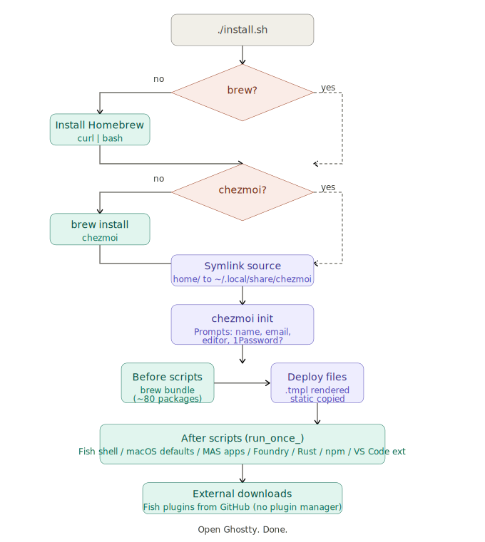
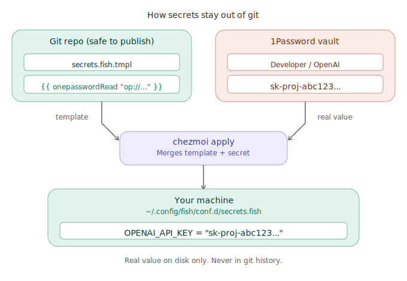
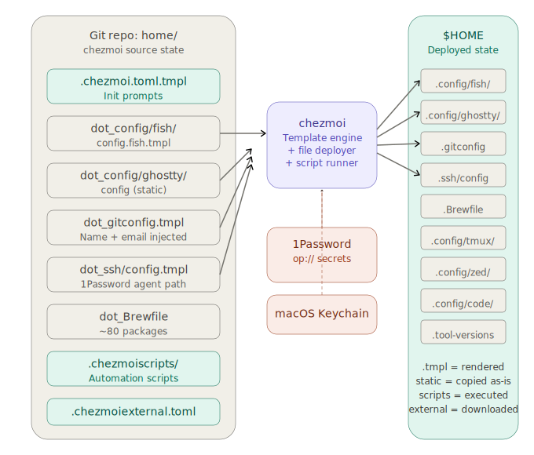

# dotfiles


A modern developer tooling stack for macOS, deployed in one command. Every tool is chosen for speed, ergonomics, and native macOS integration; no legacy defaults, no bloat.

**The stack:** [Fish](https://fishshell.com/) replaces Zsh (faster startup, better defaults). [Starship](https://starship.rs/) replaces Oh My Zsh themes (cross-shell, instant). [Ghostty](https://ghostty.org/) replaces iTerm2 (GPU-rendered, native). [delta](https://github.com/dandavison/delta) replaces diff (syntax-highlighted). [eza](https://eza.rocks/), [bat](https://github.com/sharkdp/bat), [fd](https://github.com/sharkdp/fd), [ripgrep](https://github.com/BurntSushi/ripgrep), [zoxide](https://github.com/ajeetdsouza/zoxide), [fzf](https://github.com/junegunn/fzf) replace ls, cat, find, grep, cd, Ctrl+R. [1Password](https://1password.com/) handles secrets via `op://` templates; nothing is ever stored in git. All managed by [chezmoi](https://www.chezmoi.io/) with a [gum](https://github.com/charmbracelet/gum)-powered setup wizard.

<!-- TODO: Add terminal screenshot at docs/assets/terminal.png -->
<!--  -->

**Requirements:** macOS 12+, Apple Silicon (Intel works too). First run takes ~30 minutes (Homebrew downloads).

## Quick start

```bash
git clone https://github.com/tieubao/dotfiles ~/dotfiles
cd ~/dotfiles && ./install.sh
```

A styled setup wizard ([gum](https://github.com/charmbracelet/gum)) will prompt for your name, email, editor, headless mode, and whether you use 1Password. Everything adapts accordingly. On a headless/server machine, GUI apps, dev toolchains, and casks are skipped automatically.

**Flags:**
- `./install.sh --check` -- dry-run, validates without applying
- `./install.sh --force` -- teardown and reinit from scratch
- `./install.sh --config-only` -- deploy config files only, skip brew/mas/defaults

<details>
<summary><b>Adopt on an existing Mac</b></summary>

Already have brew, fish, and your tools installed? Use `--config-only` to deploy just the config files without re-running brew bundle, mas installs, or macOS defaults:

```bash
git clone https://github.com/tieubao/dotfiles ~/dotfiles
cd ~/dotfiles && ./install.sh --config-only
```

This will:
1. Link chezmoi source to `~/dotfiles/home`
2. Prompt for your name, email, editor, headless mode, 1Password
3. Deploy all config files to `$HOME`
4. **Skip** brew bundle, Mac App Store apps, macOS defaults, toolchain installs

Then switch your shell and reload:
```bash
# Set fish as default (if not already)
grep -q /opt/homebrew/bin/fish /etc/shells || echo /opt/homebrew/bin/fish | sudo tee -a /etc/shells
chsh -s /opt/homebrew/bin/fish

# Open a new terminal to pick up the configs
```

</details>

<details>
<summary><b>Alternative: bootstrap without git</b></summary>

On a truly fresh Mac, git requires Xcode CLT (10+ minutes to install). These methods skip that:

**Via chezmoi directly (no git, no Homebrew):**
```bash
sh -c "$(curl -fsLS get.chezmoi.io)" -- init --apply tieubao
```

**Via Homebrew + chezmoi (no git):**
```bash
/bin/bash -c "$(curl -fsSL https://raw.githubusercontent.com/Homebrew/install/HEAD/install.sh)"
eval "$(/opt/homebrew/bin/brew shellenv)"
brew install chezmoi
chezmoi init --apply tieubao
```

> **Note:** These methods clone into `~/.local/share/chezmoi/` (chezmoi's default) instead of `~/dotfiles`. The git clone method is better for active development since you control the repo location.

</details>

<details>
<summary><b>Fork and customize</b></summary>

```bash
# 1. Fork this repo on GitHub
# 2. Clone your fork
git clone https://github.com/YOUR_USERNAME/dotfiles ~/dotfiles
cd ~/dotfiles

# 3. Edit what you want (see "Customization" below)
# 4. Run
./install.sh
```

</details>

## What happens on install

<p align="center">
  
</p>

1. Installs Homebrew (if missing)
2. Installs chezmoi
3. Runs setup wizard (styled prompts for name, email, editor, headless mode, 1Password)
4. Deploys all config files to `$HOME`
5. Runs automation scripts:
   - `brew bundle` -- installs ~80 packages + casks
   - Mac App Store apps via `mas`
   - macOS defaults (Dock, Finder, keyboard, trackpad, screenshots)
   - Sets Fish as default shell
   - Installs Foundry (cast), Rust, npm/uv tools
   - VS Code extensions
6. Verifies key files were deployed

## What's included

| Layer | Tools |
|-------|-------|
| **Shell** | Fish + Starship prompt + plugins (autopair, done, sponge, async-prompt) |
| **Terminal** | Ghostty (catppuccin-mocha, JetBrains Mono) |
| **Multiplexer** | tmux (C-a prefix, vim nav, fzf session picker, project launcher) |
| **Editors** | VS Code + Zed (settings, extensions, MCP servers) |
| **Git** | .gitconfig (delta diffs, aliases) + .gitignore + commit template |
| **SSH** | 1Password SSH Agent (optional), modular config.d/ |
| **Secrets** | 1Password (`op://`) + macOS Keychain -- never in git |
| **Packages** | Layered Brewfile (base/dev/apps) + Mac App Store (`mas`) |
| **Languages** | mise (Node, Python, Go, Ruby) via `.tool-versions` |
| **Containers** | OrbStack / Docker config |
| **macOS** | 30+ `defaults write` (Dock left, fast key repeat, Finder, screenshots) |
| **Web3/DeFi** | Foundry (`cast`), fish aliases + helper functions |

## Why this setup

- **Layered Brewfile** -- base tools always install; dev toolchains and GUI apps are conditional. Set `headless=true` for servers.
- **Zero plaintext secrets** -- 1Password `op://` references in templates, macOS Keychain for the rest. The rendered secrets only exist on your machine, never in git.
- **13-command CLI** -- `dotfiles sync`, `dotfiles doctor`, `dotfiles bench`, `dotfiles backup`... no need to remember raw chezmoi commands.
- **CI-tested weekly** -- shellcheck + chezmoi dry-run on macOS. Catches regressions before your next fresh install.
- **Graceful degradation** -- works with or without 1Password. Skip web3, skip Mac App Store, pick your editor. Everything is opt-in.

## Daily usage

The `dotfiles` wrapper provides ergonomic commands:

```fish
dotfiles edit ~/.config/fish/config.fish   # edit a config
dotfiles diff                              # preview changes
dotfiles sync                              # apply everything
dotfiles update                            # pull latest + apply
dotfiles status                            # managed file count + pending diffs
dotfiles doctor                            # health check (tools, config, drift)
dotfiles bench                             # benchmark shell startup time
dotfiles backup                            # back up config + age key to 1Password
dotfiles encrypt-setup                     # guided age encryption setup
```

Adding a Homebrew package:
```fish
dotfiles edit ~/.Brewfile     # add the line
dotfiles sync                 # auto-runs brew bundle
```

<details>
<summary>Raw chezmoi commands</summary>

```bash
chezmoi edit ~/.config/fish/config.fish
chezmoi diff
chezmoi apply
chezmoi apply --refresh-externals
```

</details>

## Customization

### Files you'll want to edit

| File | What to change |
|------|---------------|
| `home/dot_Brewfile.tmpl` | Add/remove Homebrew packages and casks (layered: base/dev/apps) |
| `home/dot_config/fish/config.fish.tmpl` | Shell aliases, paths, tool integrations |
| `home/dot_config/ghostty/config` | Terminal theme, font, keybindings |
| `home/dot_config/tmux/tmux.conf` | tmux prefix, keybindings, status bar |
| `home/dot_config/code/settings.json` | VS Code theme, font, settings |
| `home/dot_config/code/extensions.txt` | VS Code extensions (one per line) |
| `home/dot_config/zed/settings.json.tmpl` | Zed theme, MCP servers |
| `home/dot_tool-versions` | Global language versions |
| `home/.chezmoiscripts/run_once_after_mas-apps.sh.tmpl` | Mac App Store apps |
| `home/.chezmoiscripts/run_once_after_macos-defaults.sh.tmpl` | macOS system preferences |
| `home/.chezmoiexternal.toml` | Fish plugins to auto-download |

### Adding secrets

Secrets are injected at `chezmoi apply` time and never stored in git.

**With 1Password** (recommended):
```bash
# Store the secret
op item create --vault=Developer --category=api_credential --title="OpenAI" password="sk-..."

# Reference it in a template (e.g., secrets.fish.tmpl)
set -gx OPENAI_API_KEY "{{ onepasswordRead "op://Developer/OpenAI/password" }}"
```

**With macOS Keychain:**
```fish
keychain-set MY_TOKEN "secret-value"   # store
keychain-env MY_TOKEN                  # load into current shell
```

**On-demand loading (no apply needed):**
```fish
op-env GITHUB_TOKEN "op://Vault/GitHub Token/password"   # 1Password
keychain-env MY_TOKEN                                     # Keychain
web3-env                                                  # ETH_RPC_URL + Etherscan
```

<details>
<summary><b>Encrypted files (age)</b></summary>

For files too complex for template injection (kubeconfig, VPN configs, certificates):

```fish
# Guided setup (generates key, prints next steps)
dotfiles encrypt-setup

# Then add encrypted files
chezmoi add --encrypt ~/.kube/config
# Creates home/encrypted_dot_kube/config.age in the repo
```

Manual setup if you prefer:
```bash
brew install age
age-keygen -o ~/.config/chezmoi/key.txt
# Copy the public key (age1...) from output
chezmoi edit-config   # uncomment age section, paste public key
# Backup key.txt to 1Password as a Secure Note
```

</details>

<details>
<summary><b>Removing what you don't need</b></summary>

- **No web3?** Delete web3 aliases from `config.fish.tmpl`, remove `cast_*` functions, remove Foundry from install script
- **No 1Password?** Answer "no" during `chezmoi init` -- all 1Password sections are skipped
- **No Mac App Store?** Delete `run_once_after_mas-apps.sh.tmpl`
- **Different editor?** `chezmoi init` prompts for your choice (VS Code, Zed, Neovim, Vim)

</details>

## Troubleshooting

Run `dotfiles doctor` to diagnose issues:

```
$ dotfiles doctor
Dotfiles health check
=====================

[ok] chezmoi installed
[ok] chezmoi source linked
[ok] fish is default shell
[ok] homebrew installed
[ok] 1Password CLI: signed in
[ok] 1Password SSH agent: socket exists
[ok] ~/.gitconfig exists
[ok] ~/.config/fish/config.fish exists
[ok] ~/.ssh/config exists
[ok] git identity: Your Name <you@email.com>
[ok] fzf
[ok] bat
...
[ok] no drift detected

All checks passed.
```

<details>
<summary><b>How secrets flow</b></summary>

<p align="center">
  
</p>

On a new Mac: clone -> `./install.sh` -> `op signin` -> `chezmoi apply` -> done.

</details>

<details>
<summary><b>Architecture</b></summary>

<p align="center">
  
</p>

</details>

## Credits

Built with [chezmoi](https://www.chezmoi.io/). Inspired by [halostatue/dotfiles](https://github.com/halostatue/dotfiles) and [narze/dotfiles](https://github.com/narze/dotfiles).

## License

MIT
