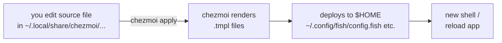
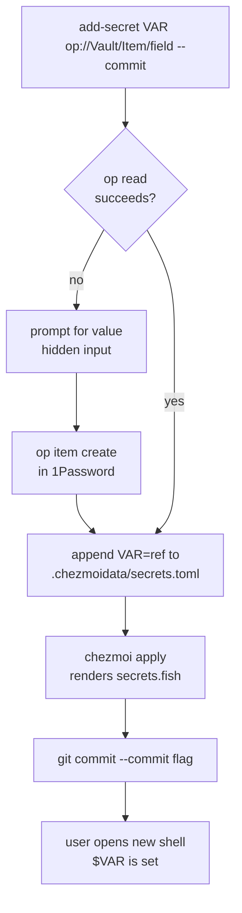

# Customization guide

How to change anything in this dotfiles repo without going back and
forth between the source directory and your machine.

## The one rule

```
edit source  →  chezmoi apply  →  effect on your machine
```

Every customization follows this shape. The source lives in the repo at
`home/` and gets linked to `~/.local/share/chezmoi`. When you run
`chezmoi apply`, chezmoi renders any `.tmpl` files, then deploys the
result to `$HOME`.



### The shortcut

Typing `chezmoi edit X --apply` does both steps in one command. This
repo ships a fish wrapper:

```fish
dfe ~/.config/fish/config.fish
```

`dfe` opens the **source** file in your `$EDITOR`; when you save and
quit, chezmoi applies immediately. No separate `chezmoi apply` call.

Other useful shortcuts you can alias yourself or type directly:

| What | Command |
|---|---|
| Apply pending changes | `chezmoi apply` |
| See what would change | `chezmoi diff` |
| Edit without applying | `chezmoi edit <path>` |
| Jump to the source dir | `chezmoi cd` |
| List everything managed | `chezmoi managed` |

## Quick reference — common customizations

| Change | File | Command |
|---|---|---|
| Homebrew packages | `home/dot_Brewfile.tmpl` | `dfe ~/.Brewfile` (auto-runs `brew bundle`) |
| Fish abbrs / env | `home/dot_config/fish/config.fish.tmpl` | `dfe ~/.config/fish/config.fish` |
| Fish function | `home/dot_config/fish/functions/NAME.fish` | `dfe ~/.config/fish/functions/NAME.fish` |
| Starship prompt | `home/dot_config/starship.toml` | `dfe ~/.config/starship.toml` |
| Ghostty config | `home/dot_config/ghostty/config` | `dfe ~/.config/ghostty/config` (live reload) |
| Ghostty theme | any time | `ghostty-theme N` — live switch |
| VS Code settings | `home/dot_config/code/settings.json` | `dfe ~/.config/code/settings.json` |
| VS Code extensions | `home/dot_config/code/extensions.txt` | edit + `chezmoi apply` |
| Zed settings + MCP | `home/dot_config/zed/settings.json.tmpl` | `dfe ~/.config/zed/settings.json` |
| Git config | `home/dot_gitconfig.tmpl` | `dfe ~/.gitconfig` |
| SSH hosts | `home/dot_ssh/config.d/*` | drop file + `chezmoi apply` |
| macOS defaults | `home/.chezmoiscripts/run_once_after_macos-defaults.sh.tmpl` | edit + `chezmoi apply` (re-runs on content change) |
| Claude Code config | `home/dot_claude/` | `dfe ~/.claude/settings.json` |
| 1Password secrets | `home/.chezmoidata/secrets.toml` | `add-secret VAR op://...` — see below |
| Fish plugins | `home/.chezmoiexternal.toml` | edit + `chezmoi apply --refresh-externals` |
| Setup wizard answers | `~/.config/chezmoi/chezmoi.toml` | `chezmoi init` to re-prompt |

## Secrets workflow

Secrets are handled differently because the value lives in 1Password,
not in the repo. Three tiers, pick per secret:

| Tier | When | Command |
|---|---|---|
| **Auto-loaded** | env var you want in every shell | `add-secret VAR "op://..."` |
| **Runtime** | occasional CLI use, don't want in every env | `op-env VAR "op://..."` |
| **One-off** | inline trial | `set -x VAR (op read "op://...")` |

### The `add-secret` flow



Example:
```fish
add-secret OPENAI_API_KEY "op://Private/OpenAI/credential" --commit
exec fish   # or open a new terminal — now $OPENAI_API_KEY is set
```

Companions:
```fish
list-secrets                    # show current bindings
rm-secret OPENAI_API_KEY        # unregister (optional --commit)
```

### How it works under the hood

`home/.chezmoidata/secrets.toml` is a registry chezmoi loads automatically
as the `.secrets` template variable. `home/dot_config/fish/conf.d/secrets.fish.tmpl`
iterates `.secrets` at apply time and emits one `set -gx` per entry,
resolving each `op://` ref via `onepasswordRead`. The rendered
`~/.config/fish/conf.d/secrets.fish` contains real tokens — it never
leaves your machine.

### Rotating a token

Just update the value in 1Password. The next `chezmoi apply` re-renders
the fish file with the new value. To force immediately:

```fish
chezmoi apply ~/.config/fish/conf.d/secrets.fish
exec fish
```

## Troubleshooting

- **"I changed the source but nothing happened"** — you probably edited
  `~/.config/...` directly. Edit the source at
  `~/.local/share/chezmoi/...` (or use `dfe`). `chezmoi diff` will show
  if your change drifted.
- **"chezmoi apply wants to prompt me"** — you modified a deployed file
  outside chezmoi. Either accept the overwrite, or `chezmoi merge PATH`
  to bring the change back into the source.
- **"op read failed"** — run `eval (op signin)` once per shell session.
- **"Template error at apply"** — a `.tmpl` file is missing a variable.
  Run `chezmoi init` to refresh the answer cache.
- **"Brewfile didn't re-run"** — `run_onchange_before_brew-bundle.sh.tmpl`
  only fires when the file content changes. Force it with
  `rm ~/.config/chezmoi/state/chezmoistate.boltdb` (nuclear) or just
  `brew bundle --file=~/.Brewfile`.

## Key design choices

- **No hand-edits to `secrets.fish.tmpl`** for new env vars — use the
  registry so the template stays small and readers see one source of
  truth.
- **`dfe` over `chezmoi edit` + `chezmoi apply`** — less to remember,
  fewer forgotten applies.
- **1Password references, not values, are in git** — rotation doesn't
  touch the repo.
