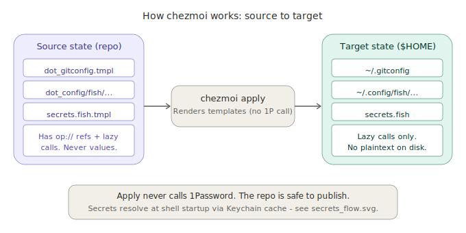
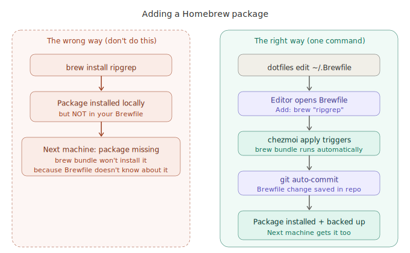
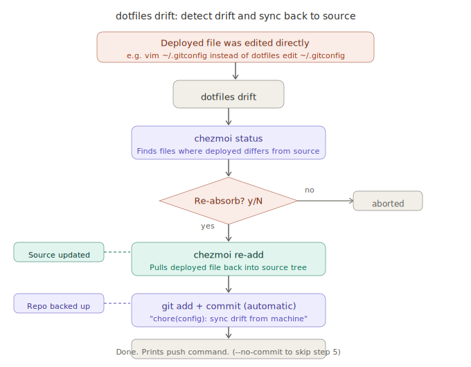
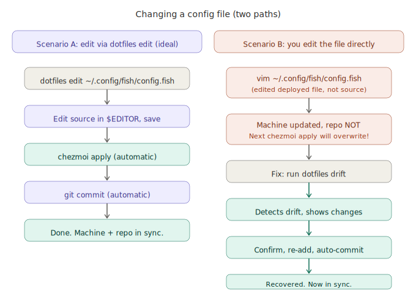
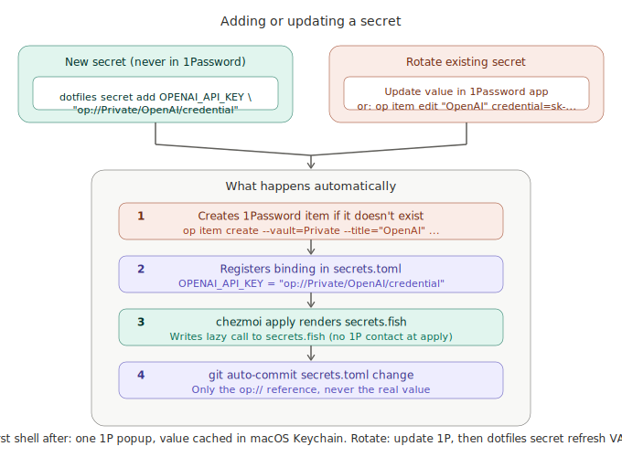

# User guide

Everything you need to use and customize this dotfiles setup. The
[README](../README.md) covers the pitch and quick start; this guide
covers how it all works and how to make it yours. For the general
LLM-maintained dotfiles pattern, see [llm-dotfiles.md](llm-dotfiles.md).

---

## 1. The LLM workflow

The primary way to maintain this repo is to ask Claude.

Run `/dotfiles-sync` in Claude Code (or just say "catch up with my
dotfiles"). Claude scans your machine across 10 dimensions: config
drift, brew packages, casks, VS Code extensions, fish functions, SSH
configs, secrets, and more. It reports what changed in plain language
and waits for your instructions.

```
You:    /dotfiles-sync
Claude: Config drift: Zed settings (2 new MCP servers)
        New packages: ollama, rclone, pandoc
        Stale: raycast, slack (not installed)
        What should I do?
You:    sync everything, drop raycast and slack
Claude: Done. 1 commit. Push?
You:    push
```

Every sync is logged in `docs/sync-log.md`. Claude reads it at the
start of each session for context ("last sync was 2 weeks ago, you
added ollama").

The `/dotfiles-sync` command is installed to `~/.claude/commands/`
during `chezmoi apply`, so it works from any directory in Claude Code,
not just the dotfiles repo. If it's missing, run `chezmoi apply` to
deploy it.

The manual commands in the sections below are fallbacks for when you're
offline, SSH'd into a server, or want a quick one-off edit. You don't
need to learn them to use this repo day-to-day.

### Core vs local packages

When syncing, Claude asks you to classify each new package:

| Classification | Where it goes | Committed? | Installed on all machines? |
|---------------|--------------|-----------|--------------------------|
| **Core** | `~/.Brewfile` (from template) | Yes | Yes |
| **Local** | `~/.Brewfile.local` | No | This machine only |
| **Skip** | Nowhere | No | N/A |

`~/.Brewfile.local` is automatically sourced by `~/.Brewfile` and uses
the same syntax (`brew "pkg"`, `cask "app"`). It is never committed to
git or managed by chezmoi. The same pattern works for VS Code extensions
via `~/.config/code/extensions.local.txt`.

**Examples of local packages:** hardware-specific tools (`chrysalis` for
Keyboardio, `lunar` for display brightness), rarely-used apps (`skype`),
disk utilities (`disk-inventory-x`).

**Manual local management** via the `dotfiles local` subcommand:
```bash
dotfiles local list                        # show everything in .local files
dotfiles local edit                        # open ~/.Brewfile.local in $EDITOR
dotfiles local promote cask chrysalis      # move from local to core (shared repo)
dotfiles local demote brew sentencepiece   # move from core to local
dotfiles local promote ext openai.chatgpt  # VS Code extension
```

Promote/demote auto-commits core changes. Tab completion suggests the exact
packages available to move in each direction.

**Other config files with machine-specific overrides:**

| Config | Local file | Include mechanism |
|--------|-----------|-------------------|
| Brew/cask | `~/.Brewfile.local` | Ruby `eval()` in `.Brewfile` |
| VS Code | `~/.config/code/extensions.local.txt` | Read by apply script |
| Fish | `~/.config/fish/config.local.fish` | `source` at end of config.fish |
| Tmux | `~/.config/tmux/tmux.local.conf` | `source-file -q` at end of tmux.conf |
| Git | `~/.gitconfig.local` | `[include] path = ...` |
| SSH | `~/.ssh/config.d/*` | `Include config.d/*` |

All `.local` paths are in `.chezmoiignore`, so `chezmoi add` won't accidentally
track them.

---

## 2. How chezmoi works

### The two layers

chezmoi keeps two copies of every config file:

| Layer | Location | Contains |
|-------|----------|----------|
| **Source** (repo) | `~/.local/share/chezmoi/home/` | Templates, `op://` refs, chezmoi prefixes |
| **Target** (machine) | `$HOME` | Rendered files with real values |

You edit the source. chezmoi renders templates and copies the result to
your home directory. This is a one-way flow: source to target.

<p align="center">
  
</p>

**Why two layers?** The source can live in a public git repo because it
never contains real secrets  - only `op://` references. The target has
your actual API keys, but it's never committed.

Here's the full bootstrap flow when you first install:

<p align="center">
  
</p>

### Where things live

```
~/dotfiles/                          ← the repo (git clone location)
├── home/                            ← chezmoi source state
│   ├── dot_gitconfig.tmpl           ← becomes ~/.gitconfig
│   ├── dot_config/
│   │   ├── fish/
│   │   │   ├── config.fish.tmpl     ← shell config
│   │   │   ├── functions/           ← one file per function
│   │   │   ├── completions/         ← tab completions
│   │   │   └── conf.d/              ← auto-sourced snippets
│   │   ├── ghostty/config           ← terminal config
│   │   ├── starship.toml            ← prompt config
│   │   ├── tmux/tmux.conf           ← multiplexer config
│   │   ├── code/                    ← VS Code settings
│   │   └── zed/                     ← Zed settings
│   ├── dot_Brewfile.tmpl            ← Homebrew packages
│   ├── .chezmoidata/secrets.toml    ← secret registry (op:// refs)
│   └── .chezmoiscripts/             ← automation scripts
├── docs/                            ← this guide, specs, ADRs
└── install.sh                       ← bootstrap script
```

Naming: `dot_` becomes `.`, `.tmpl` means "render this template",
`private_` sets mode 0600.

---

### What happens on install

<p align="center">
  
</p>

1. Installs Homebrew (if missing)
2. Installs chezmoi + runs setup wizard (name, email, editor, headless, 1Password)
3. Deploys all config files to `$HOME`
4. Runs `brew bundle` (~80 packages + casks)
5. Mac App Store apps via `mas`
6. macOS defaults (Dock, Finder, keyboard, trackpad, screenshots)
7. Sets Fish as default shell
8. Installs toolchains (Foundry, Rust, npm/uv), VS Code extensions
9. Verifies key files were deployed

**Install flags:**
- `./install.sh --check` -- dry-run, validates without applying
- `./install.sh --force` -- teardown and reinit from scratch
- `./install.sh --config-only` -- deploy config files only, skip brew/mas/defaults

**Adopt on an existing Mac:**
```bash
cd ~/dotfiles && ./install.sh --config-only
```
Then set Fish as default: `chsh -s /opt/homebrew/bin/fish`

**Bootstrap without git** (fresh Mac, no Xcode CLT):
```bash
sh -c "$(curl -fsLS get.chezmoi.io)" -- init --apply dwarvesf
```

---

## 3. Your first 30 minutes

You just ran `install.sh`. Here's what's on your machine now.

### Shell: Fish

Your default shell is now [Fish](https://fishshell.com/). It differs
from bash/zsh in a few ways:

- **Autosuggestions**  - type a few characters, Fish suggests from history
  in gray. Press `→` to accept.
- **Tab completion**  - press `Tab` for rich completions with descriptions.
- **No `.bashrc`**  - config lives at `~/.config/fish/config.fish`.
- **Abbreviations, not aliases**  - type `gs` then space, it expands to
  `git status`. Your abbreviations:

| Category | Abbreviations |
|----------|--------------|
| Git | `g` `gs` `gd` `gl` `gp` `gc` `gco` `gpr` |
| Navigation | `ls` `l` `ll` `la` `lt` `..` `...` |
| Modern replacements | `cat`→bat `top`→btop `du`→dust `df`→duf `ps`→procs |
| Tmux | `tx` `tml` `tma` `tmk` |
| Kubernetes/Docker | `k` `k9` `d` `dc` |

Fish plugins (installed without a plugin manager, via direct download):

| Plugin | What it does |
|--------|-------------|
| **autopair** | Auto-closes brackets, quotes, parentheses |
| **done** | Desktop notification when a long command finishes |
| **sponge** | Removes failed commands from history |
| **async-prompt** | Keeps the prompt responsive while git info loads |

### Terminal: Ghostty

[Ghostty](https://ghostty.org/) is your terminal. Key settings:

- **Font**: SauceCodePro Nerd Font, size 12
- **Theme**: base16-eighties-dark (switch with `ghostty-theme N`)
- **Quick toggle**: `Cmd+`` brings up the terminal from anywhere
- **Splits**: `Cmd+Shift+Enter` (right), `Cmd+Shift+-` (down)
- **Navigate splits**: `Cmd+Alt+Arrows`

### Prompt: Starship

[Starship](https://starship.rs/) shows: directory, git branch/status,
language versions (Go, Python, Node, Rust), cloud context (AWS, k8s),
and command duration (if >3s). Green arrow = last command OK, red = error.

### Editors

Your editor was set during install (`chezmoi init`). VS Code and Zed
both have managed settings and extensions. MCP servers in Zed are
pre-configured with 1Password-injected API keys.

### Verify everything works

```fish
dotfiles doctor
```

This checks: chezmoi installed, fish is default shell, Homebrew, 1Password,
key config files exist, git identity set, CLI tools present, no drift.

---

## 4. Manual commands (offline fallback)

### Editing any config

Use `dotfiles edit` (dotfile edit) for all config changes. It edits the source,
applies, and auto-commits in one step:

```fish
dotfiles edit ~/.config/fish/config.fish
```

<p align="center">
  
</p>

Pass `--no-commit` to skip the auto-commit.

### Adding a Homebrew package

Don't run `brew install` directly  - that installs locally but doesn't
update the Brewfile, so your next machine won't have it.

```fish
dotfiles edit ~/.Brewfile    # add the line, save, brew bundle runs automatically
```

<p align="center">
  
</p>

### Handling drift

If you (or an app) edited a deployed file directly, `dotfiles drift` detects and
fixes it:

```fish
dotfiles drift    # shows drifted files, prompts, re-absorbs into source, commits
```

<p align="center">
  
</p>

### Changing a config: two paths

<p align="center">
  
</p>

### The `dotfiles` CLI

For everything beyond editing, use the `dotfiles` wrapper:

| Command | Alias | Abbr | What it does |
|---------|-------|------|-------------|
| `dotfiles edit <path>` | `e` | `de` | Edit + apply + auto-commit |
| `dotfiles drift` | | `dd` | Detect and re-absorb drifted files |
| `dotfiles secret <cmd>` | | | Manage 1Password secrets (add/rm/list) |
| `dotfiles diff` | `d` | | Show pending changes |
| `dotfiles sync` | `s` | `ds` | Apply all changes |
| `dotfiles update` | `u` | `dfu` | Pull latest + apply |
| `dotfiles status` | `st` | | Managed file count + pending diffs |
| `dotfiles cd` | | | Go to chezmoi source directory |
| `dotfiles refresh` | `r` | | Re-download fish plugins |
| `dotfiles add <path>` | `a` | | Add a new file to chezmoi |
| `dotfiles doctor` | | | Health check |
| `dotfiles bench` | | | Benchmark shell startup time |
| `dotfiles backup` | | | Back up config + age key to 1Password |
| `dotfiles encrypt-setup` | | | Set up age encryption |

All subcommands have tab completions. Abbreviations expand on space (e.g. type `de` then space, it becomes `dotfiles edit`).

---

## 5. Customization cookbook

### Quick-change table

| Change | File to edit | Command |
|--------|-------------|---------|
| Homebrew packages | `dot_Brewfile.tmpl` | `dotfiles edit ~/.Brewfile` |
| Fish abbreviations/env | `config.fish.tmpl` | `dotfiles edit ~/.config/fish/config.fish` |
| Fish function | `functions/NAME.fish` | `dotfiles edit ~/.config/fish/functions/NAME.fish` |
| Starship prompt | `starship.toml` | `dotfiles edit ~/.config/starship.toml` |
| Ghostty terminal | `ghostty/config` | `dotfiles edit ~/.config/ghostty/config` |
| Ghostty theme | any time | `ghostty-theme N` |
| tmux | `tmux/tmux.conf` | `dotfiles edit ~/.config/tmux/tmux.conf` |
| VS Code settings | `code/settings.json` | `dotfiles edit ~/.config/code/settings.json` |
| VS Code extensions | `code/extensions.txt` | edit + `chezmoi apply` |
| Zed settings + MCP | `zed/settings.json.tmpl` | `dotfiles edit ~/.config/zed/settings.json` |
| Git config | `dot_gitconfig.tmpl` | `dotfiles edit ~/.gitconfig` |
| SSH hosts | `dot_ssh/config.d/*` | drop file + `chezmoi apply` |
| macOS defaults | `run_once_after_macos-defaults.sh.tmpl` | edit + `chezmoi apply` |
| Fish plugins | `.chezmoiexternal.toml` | edit + `chezmoi apply --refresh-externals` |
| Setup answers | `~/.config/chezmoi/chezmoi.toml` | `chezmoi init` |
| 1Password secrets | `.chezmoidata/secrets.toml` | `dotfiles secret add VAR op://...` |
| Claude Code security (guardrails) variant | `run_onchange_after_claude-guardrails.sh.tmpl` hash comment | edit + `chezmoi apply` |
| Personal Claude settings.json fields | `home/dot_claude/modify_settings.json` | edit + `chezmoi apply` |

### Walkthrough: add a new fish function

**Goal:** create a `weather` function that shows the forecast.
**File:** `home/dot_config/fish/functions/weather.fish` (new file)

```fish
dotfiles edit ~/.config/fish/functions/weather.fish
```

In the editor, write:
```fish
function weather --description "Show weather forecast"
    curl -s "wttr.in/?format=3"
end
```

Save and close. `dotfiles edit` applies (function is immediately available) and
auto-commits. Test it:

```fish
weather
```

**Expected result:** prints something like `Da Nang: ☀️ +31°C`.
The function is available in every new shell. The change is committed.

### Walkthrough: change your Starship prompt

**Goal:** shorten the directory display from 3 levels to 2.
**File:** `home/dot_config/starship.toml`

```fish
dotfiles edit ~/.config/starship.toml
```

Edit the `[directory]` section:
```toml
[directory]
truncation_length = 2
```

Save and close.

**Expected result:** your prompt immediately shows shorter paths
(e.g. `~/w/dotfiles` instead of `~/workspace/tieubao/dotfiles`).
The change is auto-committed.

### Walkthrough: add a VS Code extension

**Goal:** install the GitHub Copilot extension and persist it.
**File:** `home/dot_config/code/extensions.txt`

```fish
dotfiles edit ~/.config/code/extensions.txt
```

Add one extension ID per line (e.g. `github.copilot`). Save. Then:

```fish
chezmoi apply   # triggers the VS Code extension sync script
```

**Expected result:** VS Code installs the extension. The extensions
list is committed, so your next machine gets it too.

### Walkthrough: switch Ghostty theme

**Goal:** preview and switch terminal themes.
No file editing needed  - use the built-in helper:

```fish
ghostty-theme        # lists available themes with numbers
ghostty-theme 5      # switch to theme #5
```

**Expected result:** the terminal theme changes immediately (live
reload, no restart). The config file is updated in place.

### Walkthrough: add an SSH host

**Goal:** add a `staging` SSH host for quick access.
**File:** `home/dot_ssh/config.d/work-servers`

```fish
dotfiles edit ~/.ssh/config.d/work-servers
```

Write:
```
Host staging
    HostName 10.0.1.50
    User deploy
    IdentityFile ~/.ssh/id_ed25519
```

Save and close.

**Expected result:** `ssh staging` connects to 10.0.1.50. The main
`~/.ssh/config` includes everything in `config.d/` via `Include config.d/*`.
The change is auto-committed.

### Walkthrough: upgrade claude-guardrails

**Goal:** pick up a new `claude-guardrails` release (e.g. 0.3.7 -> 0.3.8).
**File:** `home/.chezmoiscripts/run_onchange_after_claude-guardrails.sh.tmpl`

Version is pinned on purpose, so upgrades are deliberate. Edit two lines:

```bash
# guardrails: variant={{ .guardrails_variant }} version=0.3.8
...
VERSION="0.3.8"
```

Commit and run `chezmoi apply`. The `run_onchange_` hash changes, the script
fires, and `npx -y claude-guardrails@0.3.8 install <variant>` merges the
new version into `~/.claude/settings.json`. Your personal overlay
(`modify_settings.json`) is unaffected.

**Expected result:** `jq '."$schema", (.permissions.deny | length), (.hooks.PreToolUse | length)' ~/.claude/settings.json`
shows the current schemastore URL, 21 deny rules (lite) or 40 (full),
and the expected hook count for the variant.

### Walkthrough: change the guardrails variant (or disable it)

**Goal:** switch from `lite` to `full`, or opt a headless box out entirely.
**File:** `~/.config/chezmoi/chezmoi.toml`

```toml
[data]
  guardrails_variant = "full"   # or "lite" or "none"
```

Run `chezmoi apply`. On `none`, the install script exits early and no
guardrails are written; existing security fields in `~/.claude/settings.json`
will stay until you remove them by hand (uninstall is not automatic, by
design - silent removal of security is a bigger risk than leftover state).

### Walkthrough: add a personal Claude Code setting

**Goal:** add a new field to `~/.claude/settings.json` that should exist on
every machine without going into claude-guardrails.
**File:** `home/dot_claude/modify_settings.json`

The file is a bash+jq script that runs on every `chezmoi apply`. It reads
the live file on stdin and emits a patched version. To add a field, extend
the first jq merge object:

```jq
$existing + {
    yourNewField: ($existing.yourNewField // "default value"),
    ...
}
```

The `//` operator keeps any existing value on the machine, only falling
back to the default. For hooks, follow the Stop-hook pattern already in
the script (filter by marker string + append) so repeated applies stay
idempotent.

**Do not** re-create `home/dot_claude/settings.json` as a regular file.
That path was abandoned in S-36 because it races with the guardrails
installer - see `docs/specs/S-36-guardrails-as-managed-installer.md`.

---

## 6. Secrets management

### The three tiers

| Tier | When to use | Command |
|------|------------|---------|
| **Auto-loaded** | Env var in every shell session | `dotfiles secret add VAR "op://..."` |
| **Runtime** | Occasional CLI use, don't pollute every env | `op-env VAR "op://..."` |
| **One-off** | Quick inline use | `set -x VAR (op read "op://...")` |

### Adding a new secret

```fish
dotfiles secret add OPENAI_API_KEY "op://Private/OpenAI/credential"
```

<p align="center">
  
</p>

This command:
1. Creates the 1Password item if it doesn't exist (prompts for the value)
2. Registers the `op://` binding in `secrets.toml`
3. Runs `chezmoi apply` to update `secrets.fish` with the lazy-resolve call (no 1P call during apply)
4. Auto-commits the registry change (only the `op://` ref, never the value)

Open a new shell (or `exec fish`) to pick up the variable. The first shell on this machine triggers one 1Password prompt per newly registered secret; Keychain caches the value silently for every shell after.

### Rotating a token

Update the value in 1Password (app or CLI). Then:

```fish
dotfiles secret refresh OPENAI_API_KEY   # clears Keychain cache, re-fetches from 1P
exec fish
```

No repo change needed -- the `op://` reference hasn't changed.

### Removing a secret

```fish
dotfiles secret rm OPENAI_API_KEY    # unregisters from secrets.toml, auto-commits
```

### Listing current secrets

```fish
dotfiles secret list
# Registered secrets (cache status from macOS Keychain):
#   [cached] OPENAI_API_KEY → op://Private/OpenAI/credential
#   [ empty] NEW_TOKEN → op://Private/New/credential
```

### How it works under the hood

`secrets.toml` is a chezmoi data file loaded as `.secrets` in templates.
`secrets.fish.tmpl` iterates the registry and emits one `set -gx` per entry,
but **does not resolve** via `onepasswordRead`. Instead, each emitted line
calls `~/.local/bin/secret-cache-read VAR OP_REF` at shell startup time,
which:

1. Looks up `VAR` in macOS Keychain (silent, ~1 ms)
2. On cache miss, runs `op read OP_REF` (1P popup if interactive)
3. Stores the result back in Keychain for next time

This means **`chezmoi apply` never calls 1Password**. Secrets are only
fetched when a shell actually starts for the first time on a machine, or
after `dotfiles secret refresh`. The rendered `secrets.fish` on disk is
safe to grep -- it contains only references, not values.

### Why Keychain instead of a dotfile cache

- **Silent after approval.** macOS prompts once per app ("allow access to this keychain item?"); after "Always Allow", reads are invisible
- **Encrypted at rest** by the OS
- **Machine-local**, which matches the rest of the local-override philosophy
- **Easy to invalidate** per-entry via `security delete-generic-password` (wrapped as `dotfiles secret refresh`)

---

## 7. Multi-machine setup

### Deploying to a second Mac

On the new machine:

```bash
git clone https://github.com/dwarvesf/dotfiles ~/dotfiles
cd ~/dotfiles && ./install.sh
```

The setup wizard prompts for the same config (name, email, editor,
1Password). If you use 1Password, sign in first (`eval $(op signin)`),
and all secrets are pulled automatically.

### Headless/server mode

During `chezmoi init`, answer `headless = true`. This skips:
- GUI apps (Ghostty, VS Code, Zed)
- Mac App Store apps
- Dev casks (Docker, Figma, etc.)
- macOS defaults

You get: Fish shell, CLI tools, git config, SSH config, tmux.

### Keeping machines in sync

On any machine:

```fish
dotfiles update    # git pull + chezmoi apply
```

Or manually:

```fish
cd ~/dotfiles && git pull
chezmoi apply
```

### Machine-specific overrides

chezmoi templates handle per-machine differences. The `.chezmoi` variable
provides hostname, OS, and arch. Example in a `.tmpl` file:

```
{{ if eq .chezmoi.hostname "work-mbp" }}
# work-specific config here
{{ end }}
```

The `headless` flag is the most common override  - it gates entire
sections of the Brewfile and script execution.

---

## 8. Troubleshooting

Start with `dotfiles doctor`  - it catches most issues.

### "I edited the wrong file"

You edited `~/.config/fish/config.fish` directly instead of the source.
Your change works now but will be lost on the next `chezmoi apply`.

**Fix:** run `dotfiles drift` to detect the drift and re-absorb it into the source.

### "chezmoi apply wants to overwrite my change"

Same root cause: the deployed file differs from the source. Options:

1. `dotfiles drift`  - pull the deployed version back into source
2. `chezmoi merge <path>`  - three-way merge
3. `chezmoi apply --force`  - overwrite deployed with source (destructive)

### "1Password errors"

- **"not signed in"**: run `eval (op signin)` or `eval $(op signin)` in bash
- **"item not found"**: check vault name and item title match the `op://` path
- **"connect timeout"**: 1Password CLI needs internet for the first auth

### "Template rendering failed"

A `.tmpl` file is missing a variable. Usually means `chezmoi init` needs
to be re-run:

```fish
chezmoi init
chezmoi apply
```

### "Brewfile didn't re-run"

The brew script only fires when the Brewfile content changes (chezmoi
tracks a hash). Force it:

```fish
brew bundle --file=~/.Brewfile
```

### "Fish function not found"

The function file must be named exactly `FUNCTIONNAME.fish` in
`~/.config/fish/functions/`. Check:

```fish
functions --names | grep yourfunction
ls ~/.config/fish/functions/yourfunction.fish
```

### "Shell startup is slow"

Benchmark it:

```fish
dotfiles bench
```

Common causes: 1Password CLI calls on every shell (move to auto-loaded
secrets), too many PATH additions, slow network for async prompt.

### "Claude Code blocked my prompt" (guardrails false positive)

The `claude-guardrails` prompt scanner saw something that matched a
secret pattern. The stderr message shows which pattern hit.

Most common causes and fixes:

| Pattern | Likely trigger | Fix |
|---------|---------------|-----|
| `BIP39 mnemonic` | 12+ consecutive words all in the BIP39 wordlist (rare in prose, near-zero FP rate after 0.3.7) | Rephrase. Check `~/.claude/hooks/patterns/bip39-english.txt`. |
| `Secret-like variable assignment` | A sentence containing `api_key = something-16-chars-plus` or similar | Rephrase without the literal pattern. |
| `Hex private key (64 chars)` | Git commit SHA pasted (sha256 is 64 hex chars) | Rephrase; git short SHAs (7-10 chars) are safe. |

If a real credential triggered the block: it was **not** sent to the
model, but you should still rotate it on the upstream service because
the prompt may already be in your shell history / clipboard / editor
undo buffer. The pattern files at `~/.claude/hooks/patterns/` are
installed by claude-guardrails; do not hand-edit them (they will be
overwritten on next upgrade). File an issue upstream if a pattern
consistently false-positives.

### "Claude Code has no security hooks / `$schema` warning"

Guardrails isn't active on this machine. Check in order:

1. `jq '."$schema"' ~/.claude/settings.json` - must be
   `https://json.schemastore.org/claude-code-settings.json`. Any other
   value (especially `https://claude.ai/schemas/...`) means Claude Code
   silently discards the file.
2. `jq '.guardrails_variant' ~/.config/chezmoi/chezmoi.toml` (should be
   `"lite"`, `"full"`, or `"none"`). If missing, re-run `chezmoi init`.
3. Re-run `chezmoi apply` - the `run_onchange_after_claude-guardrails.sh`
   script should fire. If it doesn't, check `~/.cache/dotfiles-apply.log`
   for errors.
4. Fallback: `npx -y claude-guardrails@latest install lite` directly.

### Nuclear options

If something is deeply broken:

```fish
# Re-run setup wizard (re-prompts for all config)
chezmoi init

# Force apply everything (overwrites all deployed files)
chezmoi apply --force

# Full reinstall (teardown + rebuild)
cd ~/dotfiles && ./install.sh --force
```

---

## 9. Lifecycle: install, update, uninstall

### Install (first time)

```bash
git clone https://github.com/dwarvesf/dotfiles ~/dotfiles
cd ~/dotfiles && ./install.sh
```

This installs Homebrew, chezmoi, runs the setup wizard, deploys all
configs (including `~/.claude/commands/dotfiles-sync.md`), installs
packages, sets Fish as default shell, and prints a summary.

After install, `/dotfiles-sync` is available in Claude Code from any
directory. See [section 1](#1-the-llm-workflow).

### Update (ongoing)

**Primary (LLM-assisted):** run `/dotfiles-sync` in Claude Code. Claude
detects drift, you approve, it syncs.

**Pull from remote** (new commits from another machine):

```fish
dotfiles update    # git pull + chezmoi apply
```

**Re-run setup wizard** (change name, email, editor, 1Password config):

```fish
chezmoi init       # re-prompts for all answers
chezmoi apply      # deploy with new answers
```

**Reinstall from scratch** (teardown + rebuild):

```bash
cd ~/dotfiles && ./install.sh --force
```

This removes chezmoi state and config, re-links, re-runs the wizard,
and re-applies everything.

### Uninstall

There is no automated uninstall. To remove this dotfiles setup:

**1. Restore default shell** (if you're also removing Fish):

```bash
chsh -s /bin/zsh
```

Skip this if you want to keep Fish as your shell.

**2. Remove deployed configs:**

```bash
# See what chezmoi manages
chezmoi managed

# Remove all chezmoi-managed files from $HOME
chezmoi managed | while read f; do rm -f "$HOME/$f"; done

# Remove chezmoi state and config
rm -rf ~/.local/share/chezmoi
rm -rf ~/.config/chezmoi
```

**3. Remove the Claude Code slash command:**

```bash
rm -rf ~/.claude/commands/dotfiles-sync.md
```

**4. Remove the repo:**

```bash
rm -rf ~/dotfiles
```

**5. Optionally uninstall Homebrew packages:**

```bash
# See what was installed via the Brewfile
brew bundle list --file=~/.Brewfile

# Remove everything in the Brewfile
brew bundle cleanup --force --file=~/.Brewfile

# Or uninstall Homebrew entirely
/bin/bash -c "$(curl -fsSL https://raw.githubusercontent.com/Homebrew/install/HEAD/uninstall.sh)"
```

After uninstall, your Mac reverts to Zsh with default configs. Any
1Password secrets remain in your vault (unchanged).

---

## 10. Architecture reference

<p align="center">
  
</p>

### Script execution order

During `chezmoi apply`, scripts run in this order:

1. `run_before_aa-init.sh`  - resets the apply log
2. `run_before_ab-1password-check.sh`  - validates 1Password CLI
3. `run_onchange_before_brew-bundle.sh`  - `brew bundle` (triggers on Brewfile change)
4. **File deployment**  - templates rendered, files copied
5. `run_once_after_*`  - one-time setup (Fish shell, macOS defaults, MAS apps, toolchains)
6. `run_onchange_after_*`  - VS Code extensions, Zed config (triggers on content change)
7. `run_after_zz-summary.sh`  - styled apply summary with OK/warning/error counts

`run_once_` scripts won't re-run unless their content changes.
`run_onchange_` scripts re-run when the template output changes.

### How templates work

Any file ending in `.tmpl` is rendered through Go's `text/template`
engine at apply time. chezmoi provides variables from:

- `chezmoi init` answers (`.name`, `.email`, `.editor`, `.headless`, `.use_1password`)
- `.chezmoidata/*.toml` files (`.secrets` from `secrets.toml`)
- Built-in `.chezmoi.*` (hostname, OS, arch, username)

Every `.tmpl` file validates required variables at the top with
`hasKey`/`fail` guards. Missing variables produce actionable error
messages instead of cryptic Go template errors.

### External downloads

Fish plugins and completions are defined in `.chezmoiexternal.toml` as
GitHub URLs. chezmoi downloads and caches them with a 30-day refresh.
Force re-download with `dotfiles refresh` or `chezmoi apply --refresh-externals`.

### Design decisions

Architectural choices are documented as ADRs in `docs/decisions/`:

- [001: chezmoi over GNU Stow](decisions/001-chezmoi-over-stow.md)
- [002: Fish over Zsh](decisions/002-fish-over-zsh.md)
- [003: Ghostty over Kitty](decisions/003-ghostty-over-kitty.md)
- [004: 1Password for secrets](decisions/004-1password-for-secrets.md)
- [005: No plugin manager for Fish](decisions/005-no-plugin-manager-for-fish.md)
- [006: Auto-commit workflow](decisions/006-auto-commit-workflow.md)

---

## Appendix: cheat sheet

### Commands at a glance

| I want to... | Command | Abbreviation |
|--------------|---------|-------------|
| **Batch sync everything** | **`/dotfiles-sync` (in Claude Code)** | |
| Edit any config | `dotfiles edit <path>` | `de` |
| Detect and fix drift | `dotfiles drift` | `dd` |
| Apply all changes | `dotfiles sync` | `ds` |
| Pull latest + apply | `dotfiles update` | `dfu` |
| See what would change | `dotfiles diff` | |
| Check health | `dotfiles doctor` | |
| Add a Homebrew package | `dotfiles edit ~/.Brewfile` | |
| Add a secret | `dotfiles secret add VAR "op://..."` | |
| List secrets | `dotfiles secret list` | |
| Remove a secret | `dotfiles secret rm VAR` | |
| Rotate a secret | Update in 1Password, then `chezmoi apply` | |
| Add a fish function | `dotfiles edit ~/.config/fish/functions/NAME.fish` | |
| Switch Ghostty theme | `ghostty-theme N` | |
| Benchmark startup | `dotfiles bench` | |
| Backup config | `dotfiles backup` | |
| Re-run setup wizard | `chezmoi init` | |

### Key file locations

| What | Source (repo) | Target (machine) |
|------|--------------|-------------------|
| Fish config | `home/dot_config/fish/config.fish.tmpl` | `~/.config/fish/config.fish` |
| Fish functions | `home/dot_config/fish/functions/` | `~/.config/fish/functions/` |
| Ghostty | `home/dot_config/ghostty/config` | `~/.config/ghostty/config` |
| Starship | `home/dot_config/starship.toml` | `~/.config/starship.toml` |
| tmux | `home/dot_config/tmux/tmux.conf` | `~/.config/tmux/tmux.conf` |
| Git | `home/dot_gitconfig.tmpl` | `~/.gitconfig` |
| Brewfile | `home/dot_Brewfile.tmpl` | `~/.Brewfile` |
| Secrets registry | `home/.chezmoidata/secrets.toml` | (data file, not deployed) |
| Rendered secrets | `home/dot_config/fish/conf.d/secrets.fish.tmpl` | `~/.config/fish/conf.d/secrets.fish` |
