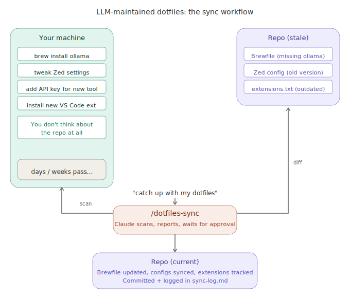

# LLM-maintained dotfiles

A pattern for keeping dotfiles repos in sync using LLMs.

This is an idea file. It describes a general pattern, not a specific
implementation. Copy it into your own LLM agent (Claude Code, Codex,
OpenCode, etc.) and adapt it to your stack. Your agent will figure out
the specifics.

<p align="center">
  
</p>

## The core idea

Most dotfiles repos assume you'll manually keep the repo in sync with
your machine. Edit the source, run apply, commit, push. The tooling is
good: chezmoi, GNU Stow, yadm, bare git repos. But the workflow has a
fundamental flaw: it depends on human memory.

In practice, you `brew install` something while debugging and forget to
update the Brewfile. You tweak a config file directly instead of going
through the dotfiles manager. You add an API key and never register it
in the secrets manager. After a few weeks, the repo is stale. After a
few months, it's fiction.

The idea here is different. Instead of expecting you to maintain the
repo, **the LLM maintains it.** You operate your machine freely.
Periodically, you ask the LLM to catch up. It scans your machine,
detects everything that drifted, reports it in plain language, and waits
for your decisions. Then it syncs the changes back into the source,
commits, and pushes.

The human curates and decides; the LLM does the bookkeeping. The tedious
part of dotfiles management isn't choosing your tools; it's keeping the
repo in sync with your choices. The LLM handles that.

## Architecture

Three layers:

**Machine state** (the source of truth) -- what's actually installed
and configured on your computer right now. Brew packages, cask apps,
config files, shell functions, API keys, editor extensions. You change
this freely, without thinking about the repo.

**The repo** (the persistent artifact) -- your dotfiles source tree.
Managed by chezmoi, Stow, yadm, or a bare git repo. This is what gets
deployed on a new machine. The LLM's job is to keep it accurate.

**The schema** (the instructions) -- a document that tells the LLM how
to scan your machine, what to detect, how to report, and how to sync.
In Claude Code this lives in `CLAUDE.md` or a slash command file. In
other agents it might be a system prompt or an AGENTS.md. This is the
key configuration file; it's what turns a generic LLM into a dotfiles
maintainer.

## Operations

### Scan

The LLM runs detection commands to compare machine state against the
repo. What to detect depends on your stack, but common dimensions:

| Dimension | Detection approach |
|-----------|-------------------|
| Config drift | Compare deployed files against source (chezmoi status, diff) |
| Package drift | Compare installed packages against package list (brew leaves vs Brewfile) |
| App drift | Compare installed apps against tracked list (brew casks, snap, flatpak) |
| Extension drift | Compare editor extensions against tracked list |
| New files | Find files in managed directories that the dotfiles tool doesn't know about |
| Secret drift | Check for hardcoded keys that should be in a secrets manager |
| Stale entries | Find entries in the repo that no longer exist on the machine |

The LLM runs these commands in parallel and collects the findings. No
custom scripts needed; the LLM calls the detection commands directly.

### Report

The LLM presents findings in plain language, grouped by category:

```
Dotfiles sync report

Config drift (2 files):
  - Zed settings  - 2 new MCP servers added
  - tmux config  - changed prefix key

New packages (5):
  ollama, rclone, pandoc, ...

Stale entries (3):
  raycast, slack (not installed, in Brewfile)

What should I do?
```

The report is conversational. The LLM adds context where it can:
"ollama is probably for local LLM testing." The user sees what changed
and why, not raw diffs.

### Decide

The LLM waits. It never syncs without approval. The user responds in
plain language:

- "Add the new packages"
- "Drop raycast, I use Spotlight now"
- "Keep btop in the Brewfile, I want it on my next machine"
- "Sync the Zed config"
- "Do everything"

This is the critical design choice: the LLM does the bookkeeping, but
the human makes the decisions. Fully automated sync is tempting but
dangerous; a bad config could propagate to every machine.

### Sync

The LLM executes the approved changes: re-adds config files, edits
package lists, updates extension lists, registers secrets. It uses the
dotfiles tool's native commands (chezmoi re-add, chezmoi add, etc.).

### Log

After each sync, the LLM appends an entry to a log file:

```markdown
## [2026-04-14] sync

Config: re-add Zed settings (2 new MCP servers)
Packages: add 5 (ollama, rclone, ...)
Stale: remove raycast, slack from Brewfile
```

The log serves two purposes. First, context for future syncs: the LLM
reads it at the start of each session and knows what happened recently.
Second, an audit trail that's easier to scan than git log.

### Commit and push

The LLM commits with a descriptive message summarizing all changes by
category. Pushing is manual: the LLM asks, the user confirms.

## Example session

```
User: catch up with my dotfiles

Claude: [scans machine, 30 seconds]

Claude: Dotfiles sync report (2026-04-14)

  Config drift (1 file):
    - Zed settings.json  - 2 new MCP servers

  New brew packages (5):
    ollama, rclone, pandoc, pipx, opencode

  Stale casks (2):
    raycast, slack (in Brewfile but not installed)

  VS Code extensions (3 new):
    docker.docker, ms-vsliveshare.vsliveshare, ocaml-platform

  What should I do?

User: sync everything, drop raycast and slack

Claude: [re-adds Zed settings, adds packages to Brewfile,
         removes raycast/slack, updates extensions.txt,
         appends to sync log, commits]

Claude: Done. 1 commit ready. Push?

User: push

Claude: [pushes]
```

The user spoke 2 sentences. The LLM handled 6 file edits, a commit
message, and a push.

## What stays manual

- **Initial setup.** Clone, install, configure. The LLM can guide you
  through it, but the first run is yours.
- **Destructive decisions.** The LLM will never auto-remove a package
  or overwrite a config without asking.
- **Push.** Always manual. A bad push propagates to every machine.
- **New tool adoption.** If you switch from Zsh to Fish, that's a
  design decision, not bookkeeping. Tell the LLM what you decided.

## Design principles

**LLM does bookkeeping, you make decisions.** The LLM never auto-syncs
without asking. It scans, reports, and waits.

**Plain language over commands.** You say "drop raycast, I switched to
Spotlight." The LLM figures out which line to delete.

**One session covers everything.** Packages, configs, extensions,
secrets, all in one pass. No separate workflows per category.

**The repo is the persistent artifact.** It compounds over time. Every sync makes it more accurate.

**No daemon, no watcher.** You trigger the sync when you want it. This
is intentional: dotfiles sync should be a conscious decision, not
background automation.

## Setting it up

### Prerequisites

You need two things:

1. **A dotfiles repo** managed by any tool (chezmoi, Stow, yadm, bare
   git). If you don't have one yet, start with
   [chezmoi](https://www.chezmoi.io/quick-start/).
2. **An LLM agent with shell access.** Claude Code, OpenAI Codex,
   OpenCode, or similar. The agent needs to run commands on your
   machine and edit files.

### Step 1: Create the sync command

Create a slash command file in two places:

```
~/dotfiles/.claude/commands/dotfiles-sync.md   # project-level (works in repo dir)
~/.claude/commands/dotfiles-sync.md            # user-level (works from any dir)
```

If you use chezmoi, add it to your source tree at
`home/dot_claude/commands/dotfiles-sync.md` and chezmoi deploys it to
`~/.claude/commands/` on apply. Otherwise, copy the file manually.

This file is the schema. It teaches the LLM what to scan, how to
report, and how to sync. Write it as a prompt that instructs the LLM
to:

1. Read the sync log for context
2. Run detection commands for each drift dimension
3. Diff results against the repo state
4. Format a plain-language report
5. Wait for user decisions
6. Execute approved changes
7. Append to the sync log
8. Commit and ask before pushing

The detection commands depend on your stack:

| Stack | Drift detection |
|-------|----------------|
| chezmoi | `chezmoi status` |
| GNU Stow | `diff -r ~/.dotfiles/ ~/` |
| Homebrew | `brew leaves` vs Brewfile |
| apt | `apt-mark showmanual` vs packages list |
| VS Code | `code --list-extensions` vs extensions.txt |
| Fish/Zsh functions | `ls` functions dir vs managed list |
| Secrets | grep for hardcoded keys in shell config |

A working reference implementation for chezmoi + Homebrew + Fish is at
[dwarvesf/dotfiles/.claude/commands/dotfiles-sync.md](https://github.com/dwarvesf/dotfiles/blob/main/.claude/commands/dotfiles-sync.md).

### Step 2: Create the sync log

```
docs/sync-log.md
```

Start with a header. The LLM appends entries after each sync:

```markdown
# Dotfiles sync log

---

## [2026-04-14] sync

Config: re-add Zed settings
Packages: add ollama, rclone
Stale: remove raycast

---
```

### Step 3: Add project context (optional but recommended)

If your LLM agent supports project instructions (CLAUDE.md, AGENTS.md,
etc.), add a brief section explaining your repo layout: where source
files live, which are templates, how secrets work. This helps the LLM
make better decisions during sync.

### Step 4: Run your first sync

```
/dotfiles-sync
```

Or just tell the agent: "catch up with my dotfiles."

### Adapting to other stacks

The pattern works with any combination:

| Layer | Options |
|-------|---------|
| Dotfiles manager | chezmoi, GNU Stow, yadm, bare git, Nix Home Manager |
| Shell | Fish, Zsh, Bash |
| Package manager | Homebrew, apt, pacman, nix |
| Secrets | 1Password, Bitwarden, SOPS, age, pass |
| LLM agent | Claude Code, OpenAI Codex, OpenCode, any agent with shell access |

The detection commands change; the pattern doesn't.

## Why this works

The tedious part of dotfiles management is not choosing tools; it's the
ongoing maintenance. Updating the Brewfile after every `brew install`.
Committing after every config tweak. Noticing when a deployed file
drifted from the source. Nobody does this consistently because the cost
of each individual sync is low but the friction is constant.

LLMs are good at exactly this kind of work: scanning for differences,
formatting reports, making mechanical edits to text files, writing
commit messages. The human's job is to operate their machine and make
decisions. The LLM's job is everything in between.

The result: a dotfiles repo that's always accurate, a sync log that
documents your machine's evolution, and a workflow that takes 30 seconds
instead of being silently skipped.
